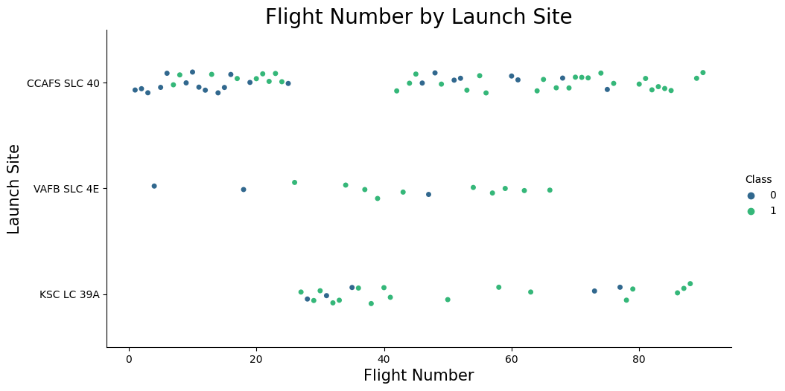

# Capstone Project:

## Table of Contents

- [Capstone Project:](#capstone-project)
  - [Table of Contents](#table-of-contents)
  - [Overview](#overview)
  - [Data Collection](#data-collection)
    - [1. API](#1-api)
    - [2. Web Scraping](#2-web-scraping)
  - [Data Wrangling](#data-wrangling)
  - [Data Exploration](#data-exploration)
    - [1. SQL Analysis](#1-sql-analysis)
    - [2. Feature Engineering and EDA](#2-feature-engineering-and-eda)
    - [3. Exploratory Data Analysis (EDA) Results](#3-exploratory-data-analysis-eda-results)
  - [Interactive Visual Analysis](#interactive-visual-analysis)

## Overview

The emerging commercial space industry has ignited a race towards more affordable and accessible space travel. Standing at the forefront of this revolution is SpaceX with its cost-efficient rocket launches, primarily attributed to the reusability of its Falcon 9 rockets' first stage. As an aspiring competitor, Space Y's data science team aims to estimate rocket launch costs by leveraging machine learning models. The objective is to predict the probability of a successful first-stage landing, thereby approximating the overall launch cost. This project uses publicly available data, data visualization tools, and machine learning techniques to yield actionable insights. The project's journey encompasses data collection, wrangling, exploration, and model building, culminating in a comprehensive presentation of findings.

## Data Collection

### 1. API

SpaceX's public API served as a primary data source, offering intricate details about rocket launches, payloads, and landing outcomes. 

[API Data Collection Notebook](notebooks/01a_data-collection_api.ipynb)

### 2. Web Scraping

To enrich the dataset, additional data was scraped from the Wikipedia page [`List of Falcon 9 and Falcon Heavy launches`](https://en.wikipedia.org/wiki/List_of_Falcon_9_and_Falcon_Heavy_launches).

[Web Scraping Data Collection Notebook](notebooks/01b_data-collection_webscraping.ipynb)

## Data Wrangling

Before diving into analysis, the data underwent rigorous wrangling to ensure its quality and reliability. This process encompassed:

- Loading and inspecting the data.
- Handling missing values.
- Data type identification and conversion.
- Summary statistics generation.
- Data transformation.
- Exporting the cleansed data for subsequent stages.

[Detailed Data Wrangling Notebook](notebooks/02_data-wrangling.ipynb)

## Data Exploration

### 1. SQL Analysis

The preliminary exploration phase utilized SQL to understand the dataset's structure and nuances. This involved loading the data into a DB2 database and executing various SQL queries to extract preliminary insights.

[SQL Data Exploration Notebook](notebooks/03a_eda-sql_sqllite.ipynb)

### 2. Feature Engineering and EDA

This phase delved deeper into the data, employing feature engineering and comprehensive exploratory data analysis (EDA) to derive actionable insights. Techniques used included:

- Data visualization for relationship analysis.
- Extracting insights from success rate trends.
- Applying One-Hot Encoding on categorical variables.

[Feature Engineering and EDA Notebook](notebooks/03b_eda_dataviz.ipynb)

### 3. Exploratory Data Analysis (EDA) Results

Our in-depth exploratory data analysis revealed several intriguing patterns and relationships in the SpaceX launch data. Below are some of the visual highlights from our EDA:

* **Flight Number vs. Launch Site**

This visualization showcases the relationship between the number of flights and their respective launch sites. From the chart, it's evident that the SLC-40 site has been the most frequently used for SpaceX launches. This suggests that SLC-40 might have some logistical or operational advantages over other sites.

* **Payload Mass vs. Launch Site**

The graph below depicts the relationship between the payload mass and the launch sites. It seems that heavier payloads tend to be launched more from the SLC-40 site. This could be attributed to the infrastructure or equipment available at this site, capable of handling larger payloads.

* **Success Rate by Orbit Type**

The success rate of SpaceX launches varies depending on the targeted orbit. As depicted in the chart, while certain orbits like 'ES-L1' and 'SO' have a 100% success rate, others like 'SSO' have experienced more variability in their success rates. This differential might be influenced by the complexity or challenges associated with reaching certain orbits.

## Interactive Visual Analysis 

With these insights in mind, we further explored the geographical positioning of these launch sites. This spatial analysis provides a deeper understanding of why certain sites might be preferred and the logistical advantages they offer.

**1. Launch Sites Overview:** 

This screenshot showcases the different launch sites that SpaceX uses for its missions. The visualization provides a geographical context to where these sites are located in relation to one another.

***Description:***
>Overview of SpaceX launch sites. Each site's strategic location offers advantages in terms of rocket launch trajectories and safety considerations.

* **Proximity to a City**
  
This image illustrates the distance of a launch site to the nearby city, Cape Canaveral. Such a visualization provides insights into the site's location in relation to populated areas.

***Description:***
>The CCAFS SLC-40 launch site's distance to Cape Canaveral city. Launch sites are typically situated at a safe distance from populated areas to minimize risks in case of launch anomalies.

**Proximity to Coast and Highway:**

This visualization emphasizes the proximity of the launch site to significant landmarks like the coastline and highways, highlighting logistical and safety considerations.

*Description:*
>The CCAFS SLC-40 launch site's proximity to the coastline and the nearest highway. Being close to the coast allows for safer rocket trajectories over the ocean, while accessibility via highways is crucial for logistics.

**Success & Failed Launches** (success_failed_launches.png):

A representation of various SpaceX launches, showcasing successful and failed attempts. This visualization provides a comprehensive look at SpaceX's launch history in terms of success rates.

*Description:*
>A spatial representation of SpaceX launches, color-coded based on success or failure. It provides an overview of SpaceX's track record over time and across different launch sites.

[Interactive Map Notebook](notebooks/04_interactive_visual_analytics.ipynb)